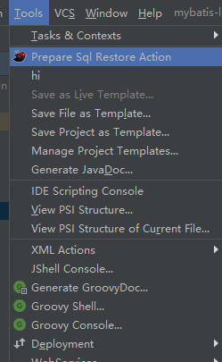
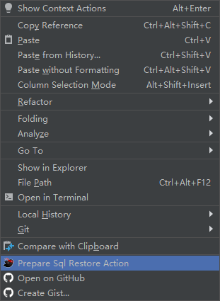

# mybatis-logrestore-plugin
mybatis 日志还原插件。预编译语句还原插件   

参考实现：
[mybatis-log-plugin](https://github.com/kookob/mybatis-log-plugin)   
该项目提供的日志还原功能较为强大，支持日志监控。
但是该项目不支持日志自定义格式，且与新版idea（2019.3.3）存在兼容性问题。

出于简单的问题简单化原则，本项目抽取了核心功能（sql功能还原），独立唤起窗口自定义粘贴sql，替换原有实现逻辑

# 插件使用方法：
## 安装：
方法一：
打开任意idea项目窗口，将zip包直接拖入编辑页面，提示restart ide，确认重启即可！
傻瓜式操作！   

方法二：
打开idea插件目录，解压拖进去

方法三：
Settings --> plugin --> install from disk(不同idea版本位置不同)

# 使用示例：
   

---

